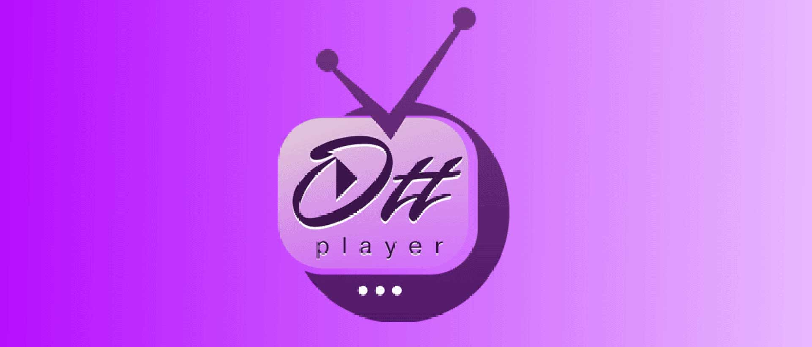

# OTTPlayer WebOS

OTTPlayer App for WebOS in Homebrew Channel



## [Screenshots](./screenshots/1.png)

## Installation

- Use [Device Manager app](https://github.com/webosbrew/dev-manager-desktop) - see [Releases](https://github.com/DjVreditel/tiktok-webos/releases) for a
  prebuilt `.ipk` binary file
- Use [webOS TV CLI tools](https://webostv.developer.lge.com/develop/tools/cli-installation) -
  `ares-install tiktok...ipk` (for webOS CLI tools configuration see below)
- Use [Homebrew Channel](https://www.webosbrew.org/), add the link into Repos of [Homebrew Channel](https://www.webosbrew.org/), and the OttPlayer app will appear in the list

  Short link — if it isn't available, use the full link (you can also use URL shortener tools so you don't have to enter a long TV link)

  ```
  https://tinyurl.com/lg-tiktok
  ```

  Original link

  ```
  https://raw.githubusercontent.com/DjVreditel/tiktok-webos/main/HomebrewChannel/tiktok.txt
  ```

## Special Thanks
[Piotr Dobrowolski](https://github.com/Informatic) and [throwaway96](https://github.com/throwaway96) for the [YouTube AdFree](https://github.com/webosbrew/youtube-webos) Application and Repo that was taken as the basis of this application
